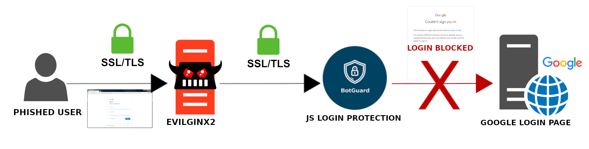

  
    
  
    
    

This repo will describe a method which allows you to successfully use MITM phishing tools on Google's login page without JS raising a fuss and [blocking login](https://i.stack.imgur.com/MnjWd.png). 

> **Warning** 
> 
> 🚨🚨🚨 This repo was created a year ago when the login page was still using the v2 login. Google did A/B testing throughout August and completely transitioned to the v3 login page as of September. Information provided here may be outdated and incorrect. 🚨🚨🚨 

## What

What I'm describing isn't a generator that creates botguard tokens nor a bypass that voids the botguard mechanism entirely, it isn't even an exploit. What I'm highlighting is that Google's anti-bot JS system uses a token to validate your request and that the token is transported via a request parameter named `bgRequest`. What I'm suggesting is a very crude method of using a headless browser to get a valid token and to use that in place of the failing one with whatever MITM phishing tool you choose. It isn't a solution, it's a quick & dirty workaround to not get blocked. 

## Why

February 2021 I wanted to use evilginx2 to make a phishing page for Google. I started to research why the then existing Google phishlets fail after submitting email and how to make a working phishlet. With little experience analyzing JavaScript (god damn the Closure Compiler), I played around with the login process in Burp for months on end to find this method.

Initially created for my own use case to go spear phishing, it fulfilled my needs. Headless browsers, however, are memory intensive and to deploy this method *en masse* in a phishing campaign isn't a good idea. Perhaps using a properly managed cluster of browsers would work, but I still have doubts

A proper solution would be to rewrite whatever checks are made in JS so that botguard won't trigger a rejected response. I haven't looked into modern anti-bot systems nor have I had any success analyzing JavaScript, so that solution is out of my reach for time being until I'm well-versed on the topic and able to make an exploit. 

## How

To succesfully log in via phishing page, you'll need to submit a **valid** botguard token in the /accountLookup request.

You can see `bgRequest=` in request params after submitting email, this parameter contains the botguard token.
Retrieve a valid token and replace the non-working token with the new, valid token.
Tokens are tied to specific accounts. A way to get a valid token, is to simply generate one on the real google.com page by trying to log in.

I used a headless browser, [go-rod](https://github.com/go-rod/rod) to retrieve the token. It will visit accounts.google.com, enter the victim's email and retrieve the token from request params.

## Notes

The previously described method is quite slow, taking about 10 seconds on my setup. I've sped it up a bit by using a REST API to retrieve the token. It initially takes 2-4 sec to start the browser, requests to open a new tab and retrieve the token take less than that. I didn't fully explore this path, but it seems that if you can work out a way to use the same page for each request, the time may possibly drop down to a few hundred milliseconds. 
*Update: It can be done using a single page session. The page's HTML can be saved and restored via browser CDP/JavaScript. I got the speed down to about 100ms per request.*

It's also worth noting that you do not have to send out the headless browser's request, since the botguard token is generated clientside via JS. Hijack and block the request so you don't get throttled/captcha'd.

As previously stated, the botguard token is generated clientside via JS. To make it you will recieve some form of binary which will then get executed at a custom javascript VM. The resulting token *might* be an encrypted string containing personally identifiable information, the current domain name, fingerprinting info, **JS variables declared outside the VM**, mouse data etc.

The issue at hand with why it doesn't work by default with evilginx (and other tools) is because the phishing page's domain differs from google.com. If you use google.com as your phishing domain and map google.com to localhost (via the hosts file), the login process on the phishing page isn't rejected due to botguard. You can get the credentials and auth tokens. I guess the `window.location` value or domain or whatever is somehow stored in the botguard token.

Google's botguard detects headless browser sessions. To circumvent this, you can use puppeteer's [stealth plugin](https://www.npmjs.com/package/puppeteer-extra-plugin-stealth). If you wish to use these evasions in go-rod, then you can do so via the [go-rod/stealth](https://github.com/go-rod/stealth) package. 

Since the genesis of this repository, by fluke or by design, the Google login page detected the headless browser once, prompting an extra evasion to be created.  It's possible that more ways to detect headless browsers will be added by Google in the future, ergo more evasion methods must be made.

## Contact

Phishing (with and w/o MITM tools) interests me a lot & I'm always interested in new challenges. Feel free to reach out to me if you want to say thanks or point out any inaccuracies/mistakes I made. My Jabber is listed on the organization page.

## Up to now

## Proposed method

